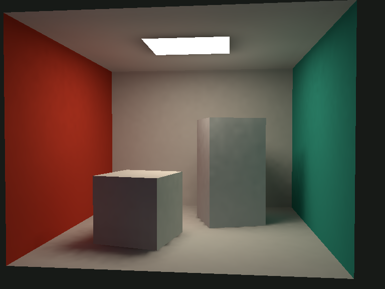

# Three GPU Baker

Progressive diffuse lightmap baking for Three.js, built with TypeScript, TSL, and WebGPU.

**Package:** `three-gpu-baker` · **Version:** 1.0.0 · **Three.js:** r186 · **License:** MIT



Bake direct and indirect illumination, separate ambient occlusion, and radiance SH9 light probes. Import Three.js scenes, GLB/glTF, or OBJ; export a detached model with a global lightmap UV atlas and lossless HDR sidecars.

## Run the documentation and examples

Requires Node.js 22.12+ or 24. Use a WebGPU-capable browser on localhost or HTTPS.

```sh
npm ci
npm run dev
```

Open the URL printed by Vite. The lighting lab includes four procedural scenes, progressive previews, channel inspection, selective denoising, and one-click exports. A CPU reference backend is available for machines without WebGPU.

## Install and bake

```sh
npm install three-gpu-baker three
```

```ts
import { LightmapBaker, LightmapIO } from 'three-gpu-baker';

const baker = new LightmapBaker({
  backend: 'tsl',
  width: 256,
  height: 256,
  samples: 128,
  bounces: 3,
});

try {
  await baker.prepare(scene); // THREE.Object3D or a CoreScene descriptor
  await baker.bake({ onProgress: (progress) => console.log(progress.fraction) });
  const result = await baker.getResult({ denoise: 'atrous', padding: true });
  const bytes = new LightmapIO().encode(result);
  // Browser: downloadBytes(bytes, 'lightmaps.tlmb'); Node: fs.writeFile(...)
} finally {
  await baker.dispose();
}
```

## Features

- Stateful progressive rendering with pause, resume, reset, cancellation, and adaptive bounded dispatches.
- Diffuse multi-bounce transport, next-event estimation, MIS, and emissive mesh sampling.
- Colored point, spot, directional, rectangular and emissive lights; linear albedo/emissive texture sampling.
- Generated planar charts or an existing global `uv1` atlas; preview resolution scaling.
- Independent direct, indirect, AO, albedo, normal, position, coverage and sample-count channels.
- Chart-aware à-trous/bilateral filters and an offline native OptiX worker.
- SH9 probe grids with interpolation, Three.js LightProbe conversion, and JSON export.
- Typed backend, denoiser, and scene compiler extension points.

## Documentation

[Quick start](docs/quickstart.md) · [API](docs/api.md) · [Configuration](docs/configuration.md) · [Examples](docs/examples.md) · [Import/export](docs/io.md) · [Denoising](docs/denoising.md) · [Probes](docs/probes.md) · [Architecture](docs/architecture.md) · [Performance and scope](docs/performance.md)

This is an **opaque diffuse baker**. Specular/refraction transport, alpha cutouts, normal mapping, HDR environment importance sampling, and animated geometry are outside v1 scope. Unsupported Three.js material features are rejected explicitly. See the scope table before integrating an asset pipeline.

## Development

```sh
npm test                # build + deterministic CPU, I/O, lifecycle and adapter tests
npm run typecheck       # strict runtime, website and example types
npm run test:gpu        # Playwright compute, render and website tests
npm run check           # types, tests, formatting and production website build
npm pack                # distributable npm tarball
```

For the browser suite, first run `npx playwright install chromium`. Native OptiX requires NVIDIA hardware and a separately installed SDK; its build instructions are in [Denoising](docs/denoising.md).

See [CONTRIBUTING.md](CONTRIBUTING.md) and [Release guide](docs/releasing.md). Repository workflows prepare CI, GitHub Pages, and npm trusted publishing; configuring and publishing the public repository/package is a maintainer action.
